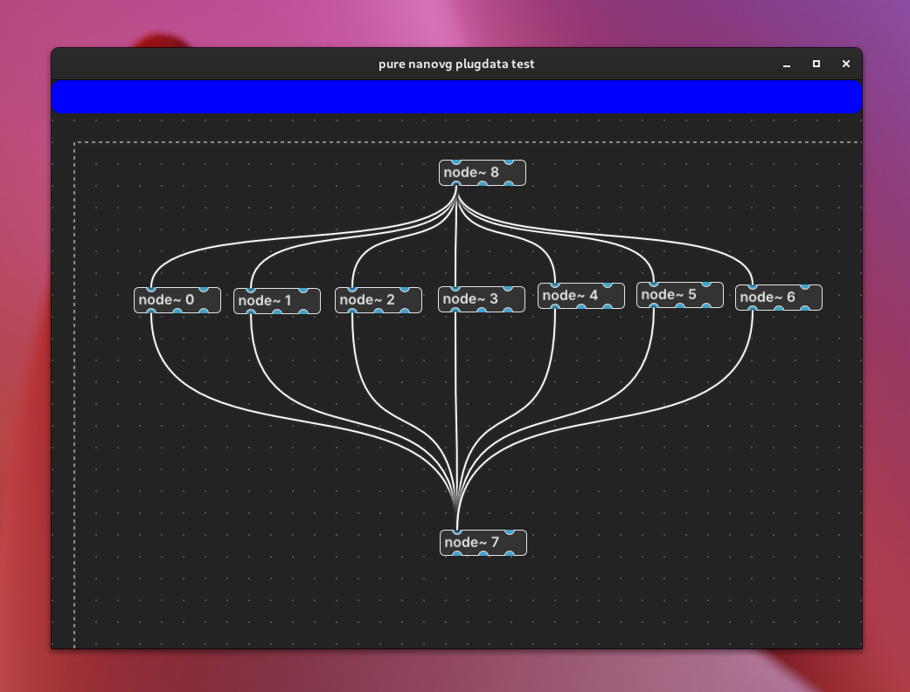

Test for using nanovg for drawing the plugdata interface.
( nanovg fork from @rgb2hsv https://github.com/rgb2hsv/nanovg)

Only tested on Linux at this point

Zooming does not work correctly yet

* Middle mouse to drag around
* Double click to add a node
* Drag from iolet to another iolet to make a connection
* Drag on canvas to select multiple objects
* Move multiple objects with mouse
* Shift drag on iolet when multiple objects are selected will drag out a cable from each iolet (at the original iolet position)
* Hover over cable will highlight the cable
* Press `s` key on keyboard to <ins>s</ins>wap cables behind objects (and vice versa)

To build:
```
$ cd plugnvg
$ git submodule update --init --recursive
$ mkdir build && cd build
$ cmake .. -DCMAKE_BUILD_TYPE=Release
$ make 
```

App will be in: `plugnvg/build/plugnvg_artefacts/Release/`

